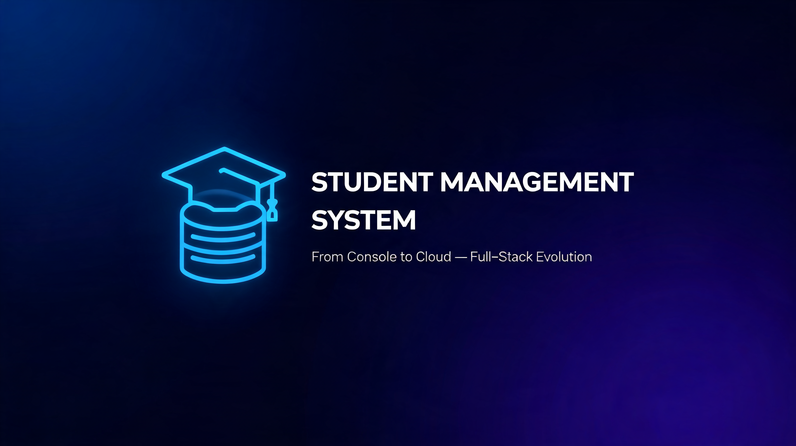
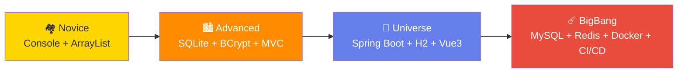

<!-- markdownlint-disable -->
<div align="center">

<a href="https://github.com/lechan775/student_management">
  
</a>

<h1>Student Management System</h1>

<p><strong>From Console to Cloud — The Full-Stack Evolution</strong></p>

[中文](README.zh-CN.md) | English | [日本語](README.ja.md)

<p>
  <a href="https://github.com/lechan775/student_management/actions">
    
  </a>
  <a href="https://github.com/lechan775/student_management/blob/main/LICENSE">
    
  </a>
  
  
  
  
  
  
  
  <a href="https://github.com/lechan775/student_management/stargazers">
    
  </a>
  <a href="https://github.com/lechan775/student_management/commits/main">
    
  </a>
</p>

<p>
  <a href="#-quick-start">🚀 Quick Start</a> •
  <a href="#-architecture">🏗 Architecture</a> •
  <a href="#-evolution-roadmap">🗺 Evolution</a> •
  <a href="#-api-reference">📡 API</a> •
  <a href="#-tech-stack">🛠 Tech Stack</a> •
  <a href="#-project-structure">📂 Structure</a> •
  <a href="#-contributing">🤝 Contributing</a>
</p>

</div>

---

## 📖 Introduction

**Student Management System** is a progressive full-stack educational project that demonstrates the complete evolution from a simple Java console application to a production-grade web platform. Designed as a learning roadmap for CS undergraduates, each version introduces enterprise-grade engineering practices incrementally.

Whether you're a beginner learning Java basics or an advanced developer exploring Docker, CI/CD, and microservice patterns — this repository has a version tailored for you.

📚 **Documentation** | 🐛 **Issues** | 💬 **Discussions** | 📧 **Contact**

---

## 🗺 Evolution Roadmap



| Version | Directory | Interface | Database | Security | Frontend | Deployment |
|---------|-----------|-----------|----------|----------|----------|------------|
| 🏘️ **Novice** | `Student_manage/` | Console | `ArrayList` | None | N/A | `javac *.java` |
| 🏙️ **Advanced** | `src/main/java/` | Console | SQLite | BCrypt | N/A | `mvn exec:java` |
| 🚀 **Universe** | `universe/` | Browser SPA | H2 | JWT | Vue3 (CDN) | `mvn spring-boot:run` |
| ☄️ **BigBang** | `bigbang/` | Full Web App | MySQL 8 + Redis | JWT Dual-Token | **Vue3+Vite+TS** | **Docker Compose** |

---

## ☄️ BigBang — Quick Start

```bash
# One-command launch
cd bigbang
docker-compose up -d

# Access
open http://localhost          # Web App (Nginx → Vue + API)
open http://localhost:8080/doc.html  # Swagger API Docs

# Default Admin
Username: admin    Password: Admin@123
```

<details>
<summary>📦 Local Development Setup</summary>

```bash
# 1. Start infrastructure
cd bigbang && docker-compose up -d mysql redis

# 2. Backend
mvn spring-boot:run          # http://localhost:8080

# 3. Frontend (separate terminal)
cd bigbang-frontend
npm install && npm run dev   # http://localhost:5173
```
</details>

---

## 🏗 Architecture

```
┌──────────────────────────────────────────────────────────────┐
│                     🌐 Nginx :80 (Reverse Proxy)              │
│  ┌─────────────────────────┐  ┌────────────────────────────┐ │
│  │   Vue 3 + Vite + TS     │  │   Spring Boot 3.2 :8080    │ │
│  │   ┌──────────┐          │  │   ┌────────────────────┐   │ │
│  │   │ Element+ │  Axios   │  │   │  Security Config   │   │ │
│  │   │ ECharts  │◄─401────┼──┼──►│  JWT Filter        │   │ │
│  │   │ Pinia    │  Refresh │  │   │  AOP Log Aspect    │   │ │
│  │   └──────────┘          │  │   └───────┬────────────┘   │ │
│  └─────────────────────────┘  │          │                 │ │
│                               │   ┌──────▼──────────┐      │ │
│  ┌──────────┐  ┌──────────┐   │   │  Service Layer  │      │ │
│  │ MySQL 8  │  │ Redis 7  │◄──┼───┤  ┌──────────┐   │      │ │
│  │ :3306    │  │ :6379    │   │   │  │ Auth     │   │      │ │
│  └──────────┘  └──────────┘   │   │  │ Student  │   │      │ │
│     ▲ Flyway       ▲ Cache    │   │  │ Log      │   │      │ │
│     │ Migration     │ Manager  │   │  │ File     │   │      │ │
│                               │   │  └──────────┘   │      │ │
│                               │   └──────────────────┘      │ │
└──────────────────────────────────────────────────────────────┘
```

---

## 🛠 Tech Stack

| Category | Technology | Version | Purpose |
|----------|-----------|---------|---------|
| **Framework** | Spring Boot | 3.2.5 | REST API Backend |
| **Database** | MySQL | 8.0 | Primary Storage |
| **Cache** | Redis | 7 (Alpine) | Session & Query Cache |
| **ORM** | Spring Data JPA | Hibernate 6.4 | Database Abstraction |
| **Migration** | Flyway | 10.x | Versioned DDL |
| **Mapping** | MapStruct | 1.5.5 | Entity ↔ DTO (Compile-time) |
| **Security** | Spring Security + JWT | jjwt 0.12 | Dual-Token Auth (access+refresh) |
| **API Docs** | Knife4j (Swagger) | 4.5 | Auto-generated OpenAPI 3 |
| **Excel** | Apache POI | 5.2.5 | Import / Export |
| **Frontend** | Vue 3 + Vite + TypeScript | Latest | SPA |
| **UI Library** | Element Plus | 2.6 | Component Library |
| **Charts** | ECharts | 5.5 | Data Visualization |
| **State** | Pinia | 2.1 | State Management |
| **HTTP** | Axios | 1.6 | API Client + JWT Interceptor |
| **Testing** | JUnit 5 + Mockito | Latest | Unit & Integration Tests |
| **CI/CD** | GitHub Actions | — | Build → Test → Coverage |
| **Container** | Docker + Compose | Latest | One-Click Deploy |
| **Proxy** | Nginx | Alpine | Reverse Proxy |

---

## 📡 API Reference

Full API documentation available at `http://localhost:8080/doc.html` after starting the server.

| Method | Endpoint | Auth | Description |
|--------|----------|------|-------------|
| `POST` | `/api/auth/login` | Public | Login → JWT Pair |
| `POST` | `/api/auth/register` | Public | Register |
| `POST` | `/api/auth/refresh` | Public | Refresh Token |
| `POST` | `/api/auth/reset-password` | Public | Forgot Password |
| `GET` | `/api/auth/me` | JWT | Current User Info |
| `GET` | `/api/students?page=&size=` | All | List (Paginated) |
| `POST` | `/api/students` | Admin/Teacher | Add Student |
| `PUT` | `/api/students/{id}` | Admin/Teacher | Update Student |
| `DELETE` | `/api/students/{id}` | Admin/Teacher | Delete Student |
| `GET` | `/api/students/search?keyword=` | All | Search by Name/Dept |
| `GET` | `/api/dashboard` | Admin/Teacher | ECharts Stats |
| `GET` | `/api/export/excel` | Admin/Teacher | Download Excel |
| `GET` | `/api/logs` | Admin | Audit Logs |
| `POST` | `/api/files/upload` | Authenticated | File Upload |

---

## 📂 Project Structure

```
student_management/
│
├── Student_manage/              # 🏘️ Novice: Basic Java OOP
│   ├── Application.java
│   ├── User.java / Student.java
│   └── cecha.java
│
├── src/main/java/com/studentmanage/  # 🏙️ Advanced: Maven + SQLite
│   ├── model/   User / Student (Entity)
│   ├── dao/     DatabaseManager / UserDAO / StudentDAO
│   ├── service/ AuthService / StudentService
│   └── ui/      LoginMenu / StudentMenu
│
├── universe/                    # 🚀 Universe: Spring Boot + Vue CDN
│   ├── pom.xml
│   └── src/main/  java/...  +  resources/static/
│
├── bigbang/                     # ☄️ BigBang: Full-Stack Production
│   ├── docker-compose.yml       # MySQL + Redis + App + Nginx
│   ├── Dockerfile               # Multi-stage build
│   ├── nginx/nginx.conf         # Reverse proxy config
│   ├── .github/workflows/ci.yml # CI/CD Pipeline
│   └── src/main/
│       ├── java/.../bigbang/
│       │   ├── config/     (5 files)  Security/Redis/Swagger/WebMvc
│       │   ├── security/   (2 files)  JwtUtil/JwtAuthFilter
│       │   ├── model/      (12 files) Entity/DTO/Enum/Mapper
│       │   ├── repository/ (4 files)  JPA + Specification
│       │   ├── service/    (4 files)  Auth/Student/Log/File
│       │   ├── controller/ (4 files)  REST API Endpoints
│       │   ├── aspect/     (1 file)   @AOP Logging
│       │   └── exception/  (2 files)  Global Error Handler
│       └── resources/
│           ├── application*.yml       # Multi-env (dev/docker/ci)
│           └── db/migration/          # Flyway V1+V2
│
├── bigbang-frontend/            # ☄️ BigBang Frontend
│   ├── package.json / vite.config.ts
│   └── src/
│       ├── router/    Vue Router
│       ├── stores/    Pinia (auth)
│       ├── api/       Axios + JWT interceptor
│       ├── views/     Login / Dashboard / Students / Logs
│       ├── components/ AppLayout
│       └── types/     TypeScript definitions
│
└── README.md / README.zh-CN.md / README.ja.md
```

---

## 🎓 Engineering Practices (BigBang)

| # | Practice | Implementation |
|---|----------|---------------|
| 1 | **Multi-Environment Config** | `application-{dev,docker,ci}.yml` |
| 2 | **Database Migration** | Flyway V1 (schema) + V2 (seed data) |
| 3 | **Dual-Token JWT** | Access (1h) + Refresh (7d) Rotation |
| 4 | **Redis Caching** | `@Cacheable` — students:5min, dashboard:15min |
| 5 | **AOP Logging** | `@Aspect` auto-capture IP + operation |
| 6 | **Global Exception Handling** | `@RestControllerAdvice` 5 exception types |
| 7 | **Bean Validation** | `@Valid` + `@NotBlank`/`@Size` |
| 8 | **MapStruct Mapping** | Entity ↔ DTO at compile-time (zero reflection) |
| 9 | **Server-Side Pagination** | `Pageable` + `JpaSpecificationExecutor` |
| 10 | **API Documentation** | Knife4j / OpenAPI 3 auto-generation |
| 11 | **Docker Multi-Stage** | `builder(jdk)` → `runner(jre)` for smaller image |
| 12 | **Health Checks** | Actuator + Docker `HEALTHCHECK` |
| 13 | **CI/CD** | GitHub Actions: compile → test → JaCoCo |
| 14 | **Frontend-Backend Separation** | Nginx proxy + Vite dev proxy |
| 15 | **JWT Silent Refresh** | Axios interceptor: 401 → auto-refresh |
| 16 | **Method-Level RBAC** | `@PreAuthorize("hasAnyRole('ADMIN','TEACHER')")` |

---

## 🤝 Contributing

Contributions welcome! Here's how:

1. 🍴 Fork the repository
2. 🌿 Create a feature branch (`git checkout -b feat/amazing-feature`)
3. ✅ Write tests for your changes
4. 💾 Commit (`git commit -m 'feat: add amazing feature'`)
5. 📤 Push (`git push origin feat/amazing-feature`)
6. 🔃 Open a Pull Request

Please ensure `mvn test` passes and follow the existing code style.

---

## 📄 License

This project is licensed under the MIT License — see the [LICENSE](LICENSE) file for details.

---

<div align="center">
  <sub>Built with ❤️ by <a href="https://github.com/lechan775">lechan775</a> | Powered by Spring Boot & Vue 3</sub>
</div>
