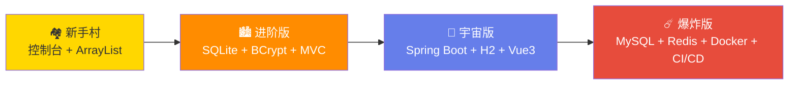

<!-- markdownlint-disable -->
<div align="center">

<a href="https://github.com/lechan775/student_management">
  
</a>

<h1>学生管理系统</h1>

<p><strong>从控制台到云端 —— 全栈演进之路</strong></p>

[English](README.md) | 中文 | [日本語](README.ja.md)

<p>
  <a href="https://github.com/lechan775/student_management/actions">
    
  </a>
  <a href="https://github.com/lechan775/student_management/blob/main/LICENSE">
    
  </a>
  
  
  
  
  
  
  
  <a href="https://github.com/lechan775/student_management/stargazers">
    
  </a>
</p>

<p>
  <a href="#-快速开始">🚀 快速开始</a> •
  <a href="#-系统架构">🏗 系统架构</a> •
  <a href="#-版本演进">🗺 版本演进</a> •
  <a href="#-接口文档">📡 接口文档</a> •
  <a href="#-技术栈">🛠 技术栈</a> •
  <a href="#-项目结构">📂 项目结构</a> •
  <a href="#-参与贡献">🤝 参与贡献</a>
</p>

</div>

---

## 📖 项目简介

**学生管理系统**是一个渐进式全栈教学项目，展示从简单的 Java 控制台应用到生产级 Web 平台的完整演进过程。每个版本都逐步引入企业级工程实践，是计算机本科生的理想学习路线图。

从零基础 Java 入门，到高级开发者探索 Docker、CI/CD、微服务模式——本仓库总有一个版本适合你。

📚 **文档** | 🐛 **问题反馈** | 💬 **讨论区** | 📧 **联系方式**

---

## 🗺 版本演进



| 版本 | 目录 | 界面 | 数据库 | 安全 | 前端 | 部署方式 |
|------|------|------|--------|------|------|----------|
| 🏘️ **新手村** | `Student_manage/` | 控制台 | `ArrayList` | 无 | 无 | `javac *.java` |
| 🏙️ **进阶版** | `src/main/java/` | 控制台 | SQLite | BCrypt | 无 | `mvn exec:java` |
| 🚀 **宇宙版** | `universe/` | 浏览器 SPA | H2 | JWT | Vue3 (CDN) | `mvn spring-boot:run` |
| ☄️ **爆炸版** | `bigbang/` | 完整 Web 应用 | MySQL 8 + Redis | JWT 双Token | **Vue3+Vite+TS** | **Docker Compose** |

---

## ☄️ 爆炸版 — 快速开始

```bash
# 一键启动
cd bigbang
docker-compose up -d

# 访问
open http://localhost          # Web 应用 (Nginx → Vue + API)
open http://localhost:8080/doc.html  # Swagger API 文档

# 默认管理员
用户名: admin    密码: Admin@123
```

<details>
<summary>📦 本地开发环境搭建</summary>

```bash
# 1. 启动基础设施
cd bigbang && docker-compose up -d mysql redis

# 2. 后端
mvn spring-boot:run          # http://localhost:8080

# 3. 前端（新终端）
cd bigbang-frontend
npm install && npm run dev   # http://localhost:5173
```
</details>

---

## 🏗 系统架构

```
┌──────────────────────────────────────────────────────────────┐
│                     🌐 Nginx :80 (反向代理)                   │
│  ┌─────────────────────────┐  ┌────────────────────────────┐ │
│  │   Vue 3 + Vite + TS     │  │   Spring Boot 3.2 :8080    │ │
│  │   ┌──────────┐          │  │   ┌────────────────────┐   │ │
│  │   │ Element+ │  Axios   │  │   │  安全配置          │   │ │
│  │   │ ECharts  │◄─401────┼──┼──►│  JWT 过滤器        │   │ │
│  │   │ Pinia    │  无感刷新 │  │   │  AOP 日志切面     │   │ │
│  │   └──────────┘          │  │   └───────┬────────────┘   │ │
│  └─────────────────────────┘  │          │                 │ │
│                               │   ┌──────▼──────────┐      │ │
│  ┌──────────┐  ┌──────────┐   │   │  业务服务层      │      │ │
│  │ MySQL 8  │  │ Redis 7  │◄──┼───┤  ┌──────────┐   │      │ │
│  │ :3306    │  │ :6379    │   │   │  │ 认证服务  │   │      │ │
│  └──────────┘  └──────────┘   │   │  │ 学生服务  │   │      │ │
│     ▲ Flyway       ▲ Cache    │   │  │ 日志服务  │   │      │ │
│     │ 版本迁移      │ 管理器   │   │  │ 文件服务  │   │      │ │
│                               │   │  └──────────┘   │      │ │
│                               │   └──────────────────┘      │ │
└──────────────────────────────────────────────────────────────┘
```

---

## 🛠 技术栈

| 类别 | 技术 | 版本 | 用途 |
|------|------|------|------|
| **框架** | Spring Boot | 3.2.5 | REST API 后端 |
| **数据库** | MySQL | 8.0 | 主存储 |
| **缓存** | Redis | 7 (Alpine) | 会话与查询缓存 |
| **ORM** | Spring Data JPA | Hibernate 6.4 | 数据库抽象 |
| **迁移** | Flyway | 10.x | 版本化 DDL |
| **映射** | MapStruct | 1.5.5 | Entity ↔ DTO（编译期） |
| **安全** | Spring Security + JWT | jjwt 0.12 | 双Token认证 |
| **文档** | Knife4j (Swagger) | 4.5 | 自动生成 OpenAPI 3 |
| **Excel** | Apache POI | 5.2.5 | 导入/导出 |
| **前端** | Vue 3 + Vite + TypeScript | 最新 | 单页应用 |
| **UI 库** | Element Plus | 2.6 | 组件库 |
| **图表** | ECharts | 5.5 | 数据可视化 |
| **状态** | Pinia | 2.1 | 状态管理 |
| **HTTP** | Axios | 1.6 | API 客户端 + JWT 拦截 |
| **测试** | JUnit 5 + Mockito | 最新 | 单元与集成测试 |
| **CI/CD** | GitHub Actions | — | 构建→测试→覆盖率 |
| **容器** | Docker + Compose | 最新 | 一键部署 |
| **代理** | Nginx | Alpine | 反向代理 |

---

## 📡 接口文档

启动服务后访问 `http://localhost:8080/doc.html` 查看完整 API 文档。

| 方法 | 接口 | 权限 | 说明 |
|------|------|------|------|
| `POST` | `/api/auth/login` | 公开 | 登录 → JWT 双Token |
| `POST` | `/api/auth/register` | 公开 | 注册 |
| `POST` | `/api/auth/refresh` | 公开 | 刷新 Token |
| `POST` | `/api/auth/reset-password` | 公开 | 忘记密码 |
| `GET` | `/api/auth/me` | JWT | 当前用户信息 |
| `GET` | `/api/students?page=&size=` | 全部 | 分页列表 |
| `POST` | `/api/students` | 管理员/教师 | 添加学生 |
| `PUT` | `/api/students/{id}` | 管理员/教师 | 更新学生 |
| `DELETE` | `/api/students/{id}` | 管理员/教师 | 删除学生 |
| `GET` | `/api/students/search?keyword=` | 全部 | 按姓名/院系搜索 |
| `GET` | `/api/dashboard` | 管理员/教师 | 仪表盘统计 |
| `GET` | `/api/export/excel` | 管理员/教师 | 下载 Excel |
| `GET` | `/api/logs` | 管理员 | 审计日志 |
| `POST` | `/api/files/upload` | 已登录 | 文件上传 |

---

## 🎓 工程实践清单（爆炸版）

| # | 实践 | 实现方式 |
|---|------|---------|
| 1 | **多环境配置** | `application-{dev,docker,ci}.yml` |
| 2 | **数据库版本迁移** | Flyway V1（建表）+ V2（种子数据） |
| 3 | **双Token JWT** | Access Token（1h）+ Refresh Token（7d）旋转策略 |
| 4 | **Redis 缓存** | `@Cacheable` — 学生5分钟 / 仪表盘15分钟 |
| 5 | **AOP 日志** | `@Aspect` 自动捕获 IP + 操作 |
| 6 | **全局异常处理** | `@RestControllerAdvice` 覆盖 5 类异常 |
| 7 | **Bean 校验** | `@Valid` + `@NotBlank`/`@Size` |
| 8 | **MapStruct 映射** | 编译期 Entity ↔ DTO（零反射开销） |
| 9 | **服务端分页** | `Pageable` + `JpaSpecificationExecutor` |
| 10 | **API 文档** | Knife4j / OpenAPI 3 自动生成 |
| 11 | **Docker 多阶段构建** | `builder(jdk)` → `runner(jre)` 减小镜像体积 |
| 12 | **健康检查** | Actuator + Docker `HEALTHCHECK` |
| 13 | **CI/CD** | GitHub Actions：编译 → 测试 → JaCoCo 覆盖率 |
| 14 | **前后端分离** | Nginx 代理 + Vite 开发代理 |
| 15 | **JWT 无感刷新** | Axios 拦截器：401 → 自动刷新 |
| 16 | **方法级 RBAC** | `@PreAuthorize("hasAnyRole('ADMIN','TEACHER')")` |

---

## 🤝 参与贡献

欢迎贡献！流程如下：

1. 🍴 Fork 本仓库
2. 🌿 创建特性分支 (`git checkout -b feat/awesome-feature`)
3. ✅ 为你的改动编写测试
4. 💾 提交 (`git commit -m 'feat: add awesome feature'`)
5. 📤 推送 (`git push origin feat/awesome-feature`)
6. 🔃 发起 Pull Request

请确保 `mvn test` 通过，并遵循现有代码风格。

---

## 📄 许可证

本项目基于 MIT 许可证开源 — 详见 [LICENSE](LICENSE) 文件。

---

<div align="center">
  <sub>由 <a href="https://github.com/lechan775">lechan775</a> 用 ❤️ 构建 | 基于 Spring Boot & Vue 3</sub>
</div>
